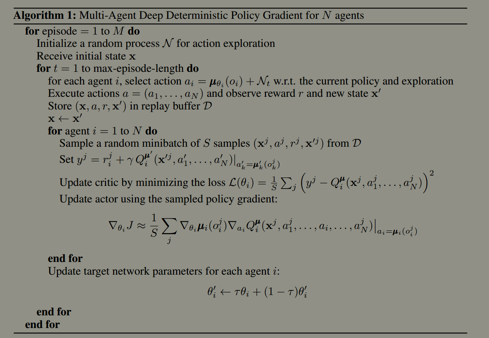
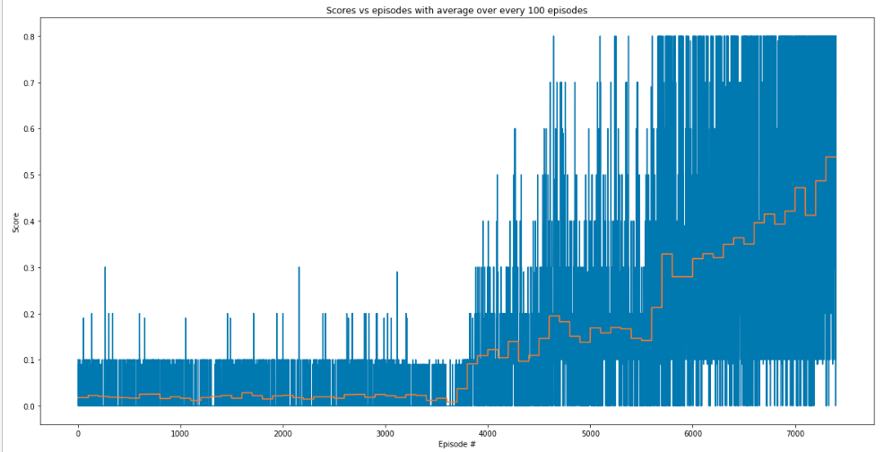

Report: Collaboration and Competition
--------

## Intruduction
Reinforcement learning (RL) has recently been applied to solve challenging problems, from game playing to robotics. Most of the successes of RL have been in single agent domains, where modelling or predicting the behaviour of other actors in the environment is largely unnecessary.

However, this project involve iteraction between two agents, hence it is a multi-agents problem where two agents control rackets to bounce a ball over a net. If an agent hits the ball over the net, it receives a reward of +0.1. If an agent lets a ball hit the ground or hits the ball out of bounds, it receives a reward of -0.01. Thus, the goal of each agent is to keep the ball in play. The environment is considered solved, when the average (over 100 episodes) of those scores is at least +0.5.

## Learning Algorithm
In this work, we implemented the multi-agent deep deterministic policy gradients (MADDPG) algorithm presented in the paper: [Multi-Agent Actor-Critic for Mixed Cooperative-Competitive Environments](https://arxiv.org/pdf/1706.02275.pdf), which is an extension and advance version of deep deterministic policy gradients (DDPG). MADDPG is favorable for multi-agent environments.

We considered the normal DDPG algorithm but did slight modifications. For each agent, we created a separate Actor-Network object and each agent was trained simultaneously.

For each episode, our algorithm gets the agents states which in turn select an action for each agent. These actions are been used to get the next states and reward for the actions. This information is stored in a buffer which our model will train from after a given number of episodes. 

In summary, our model used the following prototype:

**Figure 1**: MADDPG algorithm gotten from the paper: [Multi-Agent Actor-Critic for Mixed Cooperative-Competitive Environments](https://arxiv.org/pdf/1706.02275.pdf)

### Actor-Critic Network
Our Actor-Critic network has two aptly named components: an actor and a critic. The former takes in the current environment state and determines the best action to take from there. The critic plays the "evaluation" role by taking in the environment state and an action and returning a score that represents how apt the action is for the state.

In summary, our Actor-Critic Approach is as follows:

- Actor function specifies action (a1,a2) given the current states of the environment (s,s)
- Critic value function specifies a signal(TD Error) to criticize the actions made by the actor.

The model architecture for the Actor-Critic network is as follows:

 In total, we have 3 linear layers which weights are initialized after creation, and batch normalization, and also a  Rectified Linear Units (ReLU) nonlinearity. For the Actor-Network, we used as output features 64 and 32 for the first and second linear layers, The third layer took in the action dimension as its output feature. For the Critic-Network, we used as output features 64 and 64 for the first two linear layers while the last layer had 1 as its output feature.
 
### Hyperparameters
Through trials and errors, we finally chosed the following hyperparameters with their corresponding values:
- random seed = 2
- capacity(buffer size) = 1000000
- batch size = 600
- episodes_before_train( episodes before train) = 3000
- n_eps(number of episodes) = 8000
- LR_ACTOR(Actor learning rate): 0.0001
- LR_CRITIC(Critic learning rate): 0.001
- WEIGHT_DECAY: 0.01
- TAU(soft update of target parameters): 0.001

## Plot of Rewards

The plot above shows the reward per episodes. The plot was taken in 100 episodes steps and we can see that the environment is first solved at around **7300 to 7400 episodes** steps 

## Ideas for Future Work
Ideas for future improvements are:

- Support for convolutional neural network in order to support high dimensional states.
- Support for Recurrent Networks for input data.

- Building hyperparameter agnostic
algorithms. Such an approach would ensure that there is no
unfairness introduced from external sources when comparing
algorithms agnostic to parameters such as reward scale,
batch size, or network structure

- Further work is needed in significance testing and statistical analysis

- Find better ways of exploring large state spaces

## Thanks to:
This project is inspired by
- The paper [Multi-Agent Actor-Critic for Mixed Cooperative-Competitive Environments](https://arxiv.org/pdf/1706.02275.pdf)
- OpenAI released their [code](https://github.com/openai/maddpg) for MADDPG,
- Shariqiqbal2810's [Pytorch implementation](https://github.com/shariqiqbal2810/maddpg-pytorch) of MDDPG